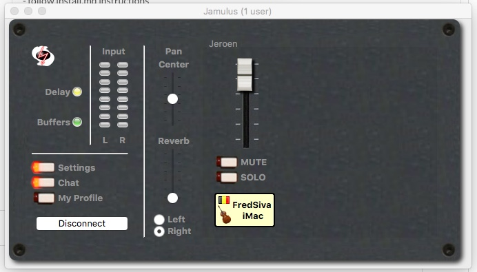

# Test

Une fois l'installation et la configuration terminée, il est temps de se brancher sur un serveur, et vérifier que l'on entend son instrument et/ou sa voix dans le casque!

## Connection
Dans Jamulus, cliquer sur "Connect", et choisir soit le "Test Server", soit n'importe quel serveur qui compte zero musiciens.  N'allez pas sur un serveur occupé par des musiciens, vous allez les déranger en plein travail!

Une fois connecté, votre nom devrait apparaitre dans la moitié droite de l'écran noir de Jamulus (Je suis ici connecté au serveur nommé "Jeroen")

Au dessus de votre nom se trouve le curseur de volume du retour de votre propre son.

## Jouer
Essayer de jouer, ou parler dans le micro, vous devez:
1. voir les vu-mêtre L/R s'allumer de bas en haut.  Régler la puissance des micros pour ne pas dépasser la zone verte.
1. vous entendre dans le casque (bien régler le volume soit via l'ordi soit via l'interface audio)
1. Si quelqu'un d'autre est sur le serveur, vous devriez l'entendre aussi

## Double entrée
Si vous utilisez une configuration avec deux entrées (un instrument et un micro), mais sans table de mixage, entrainez-vous à basculer les "Device" dans la fenêtre settings et vérifiez que les deux entrées fonctionnent bien.

Il est aussi possible d'utiliser la fenêtre de chat pour interagir avec les autres utilisateurs du serveur connecté.
